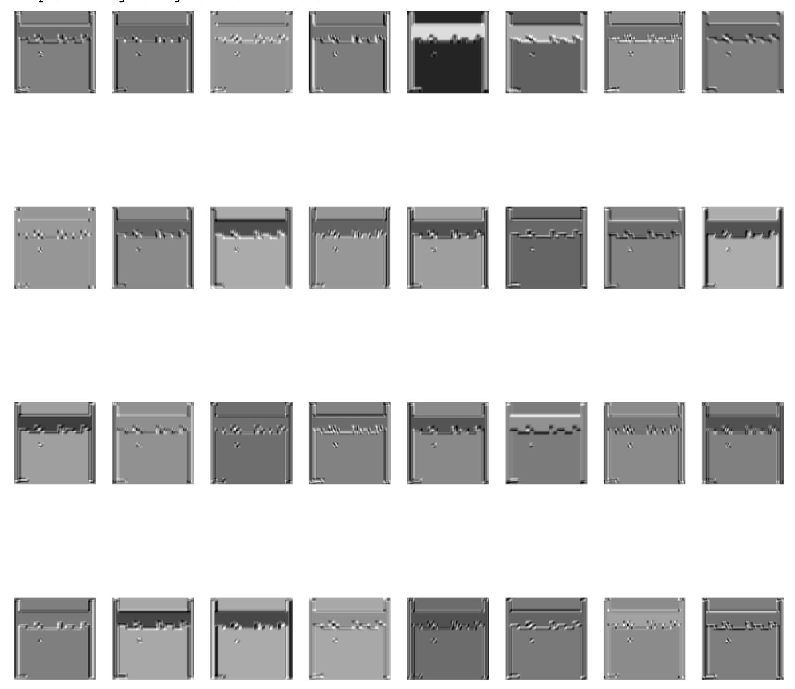

# Visualizing CNN Filters in Pytorch


This is a quick tutorial to show how you can visualizing weights / filters in a trained CNN model using PyTorch.

# Installation 

Install Anaconda first from this [link](https://conda.io/docs/user-guide/install/download.html)

Next run:
```
conda env create -f environment.yml
```

In order to start the project :
```
source activate ENVIRONMENT_NAME
jupyter notebook
```
